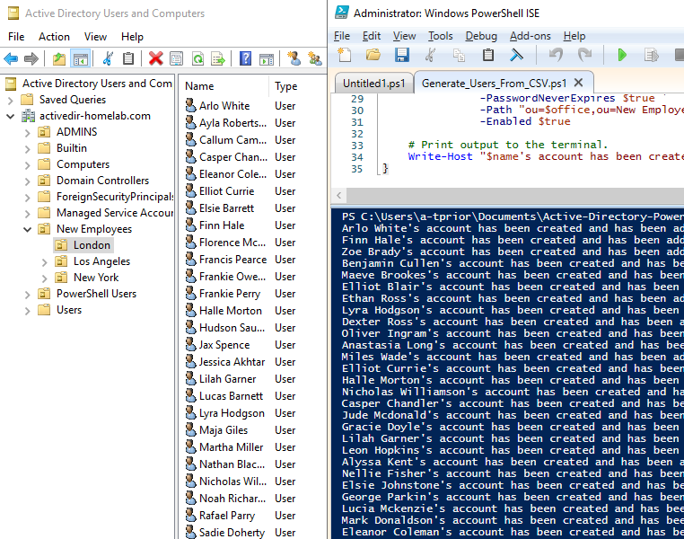

In Active Directory environments, Microsoft provides us with **ADUC** for performing simple operations like creating new users, adding and modifying properties, adding users to groups and so on.

But by using PowerShell, it allows system administrators to automate many of the repetitive tasks we commonly perform.

This post highlights some of the things you can do in PowerShell, and how we can work basic commands together to automate lengthy, trivial tasks with just a few lines of basic code.

## Prerequisites
In order to use these PowerShell commands in an Active Directory environment, there are some requirements to consider:
- Both **read** and **write** access.
- The **Remote Server Administration Tools (RSAT)** package so we're able to install the *ActiveDirectory* module in PowerShell.

## Environment
As always, I strongly suggest using a virtual or dedicated testing environment when trying out these PowerShell scripts. For reference, I'm using the environment I setup in my previous post:

- [Active Directory Homelab Using Local Virtualisation (VirtualBox)](./active-directory-homelab-using-local-virtualisation-virtualbox)

## Get-ADUser
The first cmdlet we're going to explore is [`Get-ADUser`](https://docs.microsoft.com/en-us/powershell/module/activedirectory/get-aduser?view=windowsserver2019-ps). `Get-ADUser` allows us to select and list user accounts using queries (or filters.)

### Get-ADUser > User Properties
For example, let's say we want to display all properties of a certain user. We can do this by running:
```powershell
PS C:/> Get-ADUser `
        -Identity "tprior" `
        -Properties *
```

> Here, we're using the `-Identity` parameter to specify an identifier (in this case, the username "tprior").<br /><br />
> We then use the `-Properties` parameter along with an asterix **wildcard** character (`*`) to pull all properties for that user.

<br /><br />

The `-Identity` parameter accepts the following identifiers:
- A distinguished name
- A GUID (objectGUID)
- A security identifier (objectSid)
- A SAM account name (sAMAccountName)

But what if we'd like to display the properties for all users with the surname "Smith"? This is where the `-Filter` parameter comes in, allowing us to provide specific queries:
```powershell
PS C:/> Get-ADUser `
        -Filter 'Surname -like "Prior"' `
        -Properties *
```

> The `-Filter` parameter accepts a `<FilterComponentList>`. In this case, we're asking for all users with a surname matching "Smith", using the `-like` comparison operator.<br /><br />
> For more information on Comparison Operators, see [this](https://docs.microsoft.com/en-us/powershell/module/microsoft.powershell.core/about/about_comparison_operators?view=powershell-7.2) page.

<br /><br />

Lastly, let's look at how to select specific property values (as opposed to all properties using the asterix which can get messy.)

To do this, we can add the `Select-Object` cmdlet:
```powershell
PS C:/> Get-ADUser `
        -Filter 'Surname -like "Prior"' `
        -Properties Name, Department ` | Select-Object Name, Department
```

<br />

### Get-ADUser > List Users
Now we're familiar with `Get-ADUser` and pulling specific users, let's look at pulling **all** users from a container:
```powershell
PS C:/> Get-ADUser `
        -Filter * `
        -SearchBase 'OU=Users,DC=homelab,DC=local'
```

> Again, we use the `-Filter` parameter but this time, we specify an asterix character (`*`).<br /><br />
> In addition, we've added the `-SearchBase` parameter, which allows us to provide a specific path. In this case, we're searching the OU called "Users".

<br />

To learn more about [`Get-ADUser`](https://docs.microsoft.com/en-us/powershell/module/activedirectory/get-aduser?view=windowsserver2019-ps), visit the official [Microsoft documentation](https://docs.microsoft.com/en-us/powershell/module/activedirectory/get-aduser?view=windowsserver2019-ps).

## New-ADUser
The next cmdlet we're going to explore is [`New-ADUser`](https://docs.microsoft.com/en-us/powershell/module/activedirectory/new-aduser?view=windowsserver2022-ps), which allows us to create new user accounts with just about every attribute we need in Active Directory.

For example. let's say we want to create a new user in the "Users" OU. We also want to specify their full name, department, a description and of course a password. Lastly, we want them to change their password when they next login.

Here's how it's done:
```powershell
PS C:/> New-ADUser `
        -Name "Max Headroom" `
        -GivenName "Max" `
        -Surname "Headroom" `
        -SamAccountName "mheadroom" `
        -EmployeeID "mheadroom" `
        -AccountPassword ConvertTo-SecureString "!pw1" -AsPlainText -Force `
        -ChangePasswordAtLogon $true `
        -Path "OU=Users,DC=homelab,DC=local"
        -Enabled $true
```

> There are a lot of parameters to digest here, but luckily most are self-explanatory.<br /><br />
> The most noticable include `-Path` (which allows us to specify a container for our user to live in) as well as `-SamAccountName`, which allows us to specify a logon name for the user.<br /><br />
> We also use `-AccountPassword` to set "!pw1" as the user's password, and we've set `-ChangePasswordAtLogon` to `$true`.<br /><br />
> Finally, we enable the account by setting `-Enabled` to `$true`.

<br />

## Add-ADGroupMember
So now we're familiar with adding and modifying user accounts, but what about adding users to groups? Introducing [`Add-ADGroupMember`](https://docs.microsoft.com/en-us/powershell/module/activedirectory/add-adgroupmember?view=windowsserver2022-ps).

Here's how we add our newly created user "Max Headroom" to a group called "AI":
```powershell
PS C:/> Add-ADGroupMember `
        -Identity "AI" `
        -Members "mheadroom"
```

> Similarly to `Get-ADUser`, we use the `-Identity` parameter to first select a group (in this case "AI"), and then use `-Members` to specify the member(s) we want to add to the group.<br /><br />
> If you're on the ball, you'll remember that the `-Identity` parameter only accepts a few identifiers. Using the identifier "*Max Headroom*" won't work, so we specify the `SamAccountName` instead.

<br />

## Let's Automate
Now the fun stuff! We've explored the basics of user operations in PowerShell, so let's apply this knowledge and put it into action. But first, a scenario:

<br />

> Imagine you're at work, it's nearly time to go home and you're officially *done for the day*, it's been a long one to say the least. Then in the corner of your eye you see a new email from your boss. *Here we go...*<br /><br />> "Hey, can you make sure that job is done before you go?"<br /><br />
> You check your inbox with absolute despair and *bam* there it is - an email from HR. You've been given a .csv and asked to kindly provision 100+ new sales employee accounts, adding each to their respective offices and group. *Fml.*

<br /><br />

But don't worry - PowerShell has got you, remember?!

Let's kick some AD-Ass. 🦸

We're going to write a script that does this all for us. For this, we'll need a .csv file which you can [download here](https://github.com/tarranprior/DevOps/tree/main/Azure/Scripting/PowerShell/Active-Directory/Create_Users_From_CSV). This file contains all of the information we need for each new user (or employee.)

Then, open **PowerShell ISE** so we can compose our script. You may also need to run as administrator!

1. First we're going to import the .csv file using `Import-Csv`:
    ```powershell
    # Import the .csv data in a new variable called "USER_LIST".
    $USER_LIST = Import-Csv -Path ./Employees.csv
    ```

2. For the sake of this guide, we're also going to create a parent OU for our new employees to live in using the `New-ADOrganizationalUnit` cmdlet:
    ```powershell
    # Create the parent OU for new employees.
    New-ADOrganizationalUnit -Name "New Employees" -ProtectedFromAccidentalDeletion $false
    ```

3. Then we enumerate through the list of users from the .csv and specify the attributes in a new set of variables such as `first`, `last`, `office` and `password`:
    ```powershell
    # Enumerate through the list of users.
    foreach ($u in $USER_LIST) {
        $first = $u.FirstName
        $last = $u.LastName
        $full = "$first $last"
        $username = "$($first.Substring(0,1))$($last)".ToLower()
        $password = ConvertTo-SecureString "!password1" -AsPlainText -Force
        $office = $u.Office
    }
    ```

4. Next, we want to ensure that an OU exists for each office:
    ```powershell
    # Check if OU exists for each office.
    if (Get-ADOrganizationalUnit -Filter "distinguishedName -like 'OU=$office,OU=New Employees,$(([ADSI]`"").distinguishedName)'") {
    } else {
    New-ADOrganizationalUnit -Name $office -Path "OU=New Employees,$(([ADSI]`"").distinguishedName)" -ProtectedFromAccidentalDeletion $false
    }
    ```

5. Next, we create each user using `New-ADUser`:
    ```powershell
    # Create user with given properties.
    New-ADUser `
        -AccountPassword $password `
        -GivenName $first `
        -Surname $last `
        -DisplayName $full `
        -Name $full `
        -SamAccountName $username `
        -EmployeeID $username `
        -PasswordNeverExpires $true `
        -Path "OU=$office,OU=New Employees,$(([ADSI]`"").distinguishedName)" `
        -Enabled $true
    ```

6. Now let's add the user to an existing group. For this guide, I've already created a global group called "Sales", which we'll add the users to:
    ```powershell
    # Add user to global group called "Sales".
    Add-ADGroupMember `
        -Identity "Sales" `
        -Members $username
    ```

7. Lastly, we use `Write-Host` to print some output to the terminal:
    ```powershell
        # Print output to the terminal.
        Write-Host "$full's account has been created under $office and added to Sales."
    ```

If we put all that together, we get the following script:
```powershell
# Import the .csv data in a new variable called "USER_LIST".
$USER_LIST = Import-Csv -Path ./Employees.csv

# Create the parent OU for new employees.
New-ADOrganizationalUnit -Name "New Employees" -ProtectedFromAccidentalDeletion $false

# Enumerate through the list of users.
foreach ($u in $USER_LIST) {
    $first = $u.FirstName
    $last = $u.LastName
    $full = "$first $last"
    $username = "$($first.Substring(0,1))$($last)".ToLower()
    $password = ConvertTo-SecureString "!password1" -AsPlainText -Force
    $office = $u.Office

    # Check if OU exists for each office.
    if (Get-ADOrganizationalUnit -Filter "distinguishedName -like 'OU=$office,OU=New Employees,$(([ADSI]`"").distinguishedName)'") {
    } else {
    New-ADOrganizationalUnit -Name $office -Path "OU=New Employees,$(([ADSI]`"").distinguishedName)" -ProtectedFromAccidentalDeletion $false
    }

    # Create user with given properties.
    New-ADUser `
        -AccountPassword $password `
        -GivenName $first `
        -Surname $last `
        -DisplayName $full `
        -Name $full `
        -SamAccountName $username `
        -EmployeeID $username `
        -PasswordNeverExpires $true `
        -Path "OU=$office,OU=New Employees,$(([ADSI]`"").distinguishedName)" `
        -Enabled $true

    # Add user to global group called "Sales".
    Add-ADGroupMember `
        -Identity "Sales" `
        -Members $username

    # Print output to the terminal.
    Write-Host "$full's account has been created under $office and added to Sales."
}
```

<br />

The only thing left to do is run the script and watch the magic happen! (Don't forget to save it in the same directory as the .csv file, and with the `.ps1` extension. For example - `Create_Users_CSV.ps1`.)



<br />

## Further Resources
If you'd like to explore more automation scripts for Active Directory environments, feel free check out my DevOps repository [here](https://github.com/tarranprior/DevOps/tree/main/Azure/Scripting/PowerShell/Active-Directory)! You can also find the official documentation for Microsoft PowerShell's ActiveDirectory module below.

- [Microsoft PowerShell / Active Directory Module Documentation](https://docs.microsoft.com/en-us/powershell/module/activedirectory/?view=windowsserver2022-ps)

