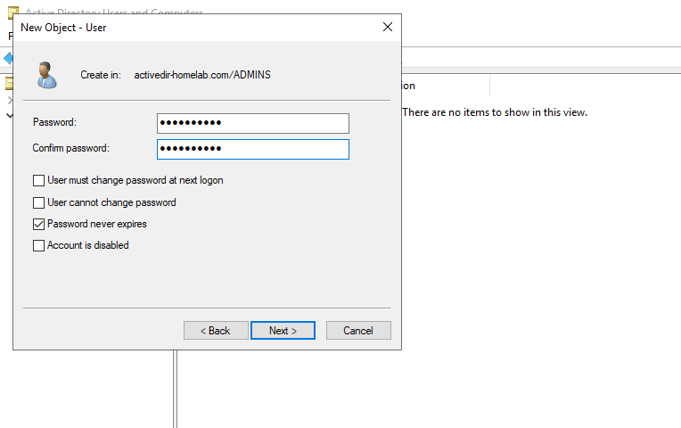

The **ultimate guide** to a full-blown virtual **Active Directory** homelab environment. For hands-on testing, training and security research.


<br />

This guide demonstrates how to **setup**, **install** and **configure** a full-blown **Active Directory environment** using local virtualisation (VirtualBox) from scratch. To take it a step further, we'll also be using PowerShell scripting to populate our lab with hundreds of user credentials.

I'll be walking through some core network components and services such as **DHCP**, **RAS/NAT** and **Domain Services (AD DS)**, as well as basic fundamentals of computer networking and enterprise-level infrastructure.

## What is Active Directory?
Before we begin, here's a quick summary of both Active Directory and virtualisation.

**Active Directory** is a directory service and management solution that stores, organises and provides access to information about users, devices, files and more (referred to as *objects*) in a system network. This allows system administrators to directly manage and configure thousands of users/devices from a central location.

Microsoft provides Active Directory as a set of services built exclusively for **Windows operating systems**, and it's currently the industry standard in enterprise-level environments. In fact - 90 percent of the [Fortune Global 500](https://fortune.com/global500/) use it as their primary service for network authentication and authorisation.

To say it was popular would be an understatement. If you work in IT, you've probably come across it at some point.

## What is Virtualisation?
**Virtualisation** allows us to simulate virtual instances of computer systems in a separate container abstract from the physical (or host) machine.

This means we're able to use software and services such as Active Directory without altering our native system, providing a safe and practical learning environment.

Security researchers will often use virtual machines to not only to add an extra layer of security to their system, but because many Linux distributions come equipped with all the tools they require to carry out their research (such as Kali Linux.) 

Today, virtualisation is common practice in information technology architecture, as it allows us to dynamically allocate and further utilise underlying portions of physical hardware to multiple instances (computers.) And ultimately, helps drastically reduce the cost of large-scale infrastructure.

## Prerequisites
To setup this virtual environment, it's recommended your host machine meets the following requirements:
- **Processor**: 1.4 GHz or faster 64-bit supported processor.
- **RAM**: 2 GB +
- **HDD**: 50 GB + of available free disk space.

In addition, we'll need to download and install VirtualBox - the virtualisation software we're using, as well as the operating system evaluation files.
- **Oracle VM VirtualBox** (Latest version. You can also use alternative software such as VMWare.)
- **Windows 10 Enterprise Evaluation ISO** (download below.)
- **Windows Server 2019 Evaluation ISO** (download below.)

<br />

### VirtualBox
You can download and install the latest version of VirtualBox [here](https://www.virtualbox.org/wiki/Downloads), or use the link below.

- https://www.virtualbox.org/wiki/Downloads

### 💿 Windows 10 Enterprise Evaluation
The next step is to grab our fresh evaluation copy of Windows 10. Visit the Microsoft product page [here](https://www.microsoft.com/en-us/evalcenter/evaluate-windows-10-enterprise) and simply click "download the ISO".

- https://www.microsoft.com/en-us/evalcenter/evaluate-windows-10-enterprise

This will bring you to a registration page so we can get our free trial. Complete the short form and hit the download button.

> Tip: If you don't want to enter your personal information, use a [name generator](https://www.fakenamegenerator.com/). You won't need to verify the email address!

<br />

### 💿 Windows Server 2019 Evaluation
Lastly, to download the Server 2019 ISO, visit the Microsoft product page [here](https://www.microsoft.com/en-us/evalcenter/evaluate-windows-server-2019).

- https://www.microsoft.com/en-us/evalcenter/evaluate-windows-server-2019

Again, complete the short form and click the download button.

<br /><br />

#### Extra Sidenote
To prevent any ambiguity, it's also a good idea to rename our image files to distinguishable filenames, and ensuring they're stored in the same directory.

For example: `WINDOWS_10_ENTERPRISE_EVAL.iso` and `WINDOWS_SERVER_2019_EVAL.iso` in our downloads directory (C:/Users/User/Downloads.)

## 1 - Setup & Installation of Windows Server
Once VirtualBox is installed and we have our copy of Windows Server, let's begin by setting up our virtual environment. This involves setting up our server machine, acting as the domain controller.

**Step 1**: Open VirtualBox and click the "New" button which will open a new window.

From here, we can choose a name for the machine. Since we're using this as our domain controller, we can choose something like `DC-DomainController`.


<br />

We also set the type to Microsoft Windows, and the version to Windows 2019 (64-bit.)

**Step 2**: Hit next, and set the amount of memory you'd like to allocate to the machine. In this instance, I'll choose 2048 MB, equivalent to 2 GB.


<br />

**Step 3**: From here, you're able to freely click next - keeping all default settings until the setup is complete.

**Step 4**: The next step is to configure the system settings of our machine. Start by clicking "Settings" > "Advanced".

Then set both "Shared Clipboard" and "Drag'n'Drop" to "Bidirectional".


<br />

Next, go to "System" > "Processor".

Here we can specify how many cores we would like to allocate to our machine. In this instance I'll go with two cores.


<br />

Finally, go to "Network" > "Adapter 2" and enable it by clicking the checkbox. This'll enable the dropdown, in which we'll select "Internal Network".


<br />

Click OK to save these settings and close the window.

**Step 5**: Fire up the machine by selecting it and clicking Start (or simply double click.)

You'll be prompted to select a start-up disk.

This is where we select our **Windows Server 2019** file. Click the small folder icon, click "Add" and browse to the directory where you downloaded your files.

Open the Windows Server 2019 ISO, then click Choose. Finally, click Start to select the disk.


<br />

**Step 6**: We're now ready to install the operating system.

Go through the installation wizard, selecting your language, keyboard layout etc.


<br/>

Then simply click the install button.


<br />

After a minute or so, another wizard will pop up prompting us to select an operating system.

Since we're virtualising a small-scale environment, we'll select "Standard Evaluation (Desktop Experience").


<br />

Click next, accept the license terms (read it if you like! 🙃) and click next again.

For the type of installation, select "Custom".


<br />

You'll be asked where to install Windows. Keep the default settings, and click next.


<br />

Windows will now start to install. This is probably going to take a while, so sit back and grab yourself a cuppa in the meantime. ☕


<br />

Once the install completes, allow the machine to reboot and set a new password for the administrator account.

> Remember to keep your passwords **simple and meaningful** when setting up virtual machines - so you don't forget later. Something like `!password1` will suffice.

<br />


<br />

Finally, unlock the home screen by going to "Input" > "Keyboard" > "Insert Ctrl-Alt-Del" as shown in the screenshot below.


<br />

You'll then be able to login to Windows Server 2019 using your new administrator account.


## 2 - Installing VirtualBox Guest Additions
The next stage is to install VirtualBox Guest Additions. This will provide optimal performance when using our virutal environment.

**Step 1**: In VirtualBox, start by going to "Devices" > "Insert Guest Additions CD image..."


<br />

Next, go back into Windows Server 2019 and navigate to "My PC".

Here, you'll see a new CD drive: `VirtualBox Guest Additions`.


<br />

Double click to explore the drive, and look for `VBoxWindowsAdditions-amd64`. Open that file, and complete the installation, sticking to the default settings.


<br />

You'll be prompted to reboot your machine. Ignore this, and select "I want to manually reboot later".


<br />

**Step 2**: To complete the installation, simply shut down the machine by going to the "Start Menu" > "Shutdown".

> This is just a safe way to preserve the installation. An automatic reboot may cause errors.

<br />

Once the machine shuts down, fire it back up and you'll now have VirtualBox Guest Additions installed.

This will provide better integration between our virtual envrionment and the host machine, and enhances the overall performance.

<br />

## 3 - Configuring Server Network Adapters
**Step 1**: Back in Windows Server, go to "Settings" > "Network & Internet" > "Change adapter options".


<br />

Here we'll see two network adapters. If you recall back to the setup - the extra adapter is the one we enabled as an internal network.

We can confirm this by looking at the IPv4 addresses of each adapter. To do so, start by right clicking and selecting "Status" > "Details" to view the network connection properties of each adapter.


<br />

- **Ethernet 1**: 169.254.x.x
- **Ethernet 2**: 10.x.x.x

As shown in the screenshot, `Ethernet 1` has been given an autoconfiguration address. This indicates it's an **internal address**.

> The internal address is used on your local network. An external address allows you to connect to other machines over the internet.

<br />

**Step 2**: At this stage, it's a good idea to rename these adapters to more meaningful names. This way, we can easily distinguish the two and identify which one is which in the future.

For this example, I'll rename the first adapter to `INTERNAL` and our external adapter to `EXT-INTERNET`.

- Right click > Rename > `Ethernet 1` > `INTERNAL`.
- Right click > Rename > `Ethernet 2` > `EXT-INTERNET`.


<br />

The next step is to manually assign our own IP address to the `INTERNAL` adapter.

Once again, simply right click and select "Properties". Then double click "Internet Protocol Version 4". Enable "use the following IP address" and enter:

- **IP address**: 172.16.0.1
- **Subnet mask**: 255.255.255.0

> 📍 Note: The default gateway can be left blank.

<br />

Next, enable "Use the following DNS addresses" and enter the localhost address:

- **Preferred DNS server**: 127.0.0.1


<br />

Lastly, click OK to save the new configuration and close the window. Our adapter is now ready to go!

**Step 3**: As a final step we should rename the PC so it's a little less generic.

You can do this by right clicking the start menu and selecting "System", then select "rename this PC". To keep the naming convention consistent, I'll use `DC-DomainController`.


<br />

We can then perform a restart to complete the changes.

## 4 - Installing Active Directory Domain Services
**Step 1**: Open "Server Manager".

**Step 2**: Select "Add roles and features" and click next until you reach the page shown below.


<br />

Select "Active Directory Domain Services" and click "Add Features".


<br />

Keep clicking next until you're prompted to install, then click install. Once complete - you can close the window.


<br />

**Step 3**: Now we have the services, you'll see a warning symbol at the top right of Server Manager. Left click it, and select "Promote this server to a domain controller".


<br />

Next, select "Add new forest" and enter a domain address. You can pick any domain you like (`homelab.local`, `mydomain.com` etc.) but for this example I'll go with `activedir-homelab.com`.


<br />

Click next, and set a DSRM password. To keep things simple, I'll use the same as my administrator account.


<br />

As always, continue to click next until you're prompted with an install. Click install. Once complete, restart your machine.

Upon restarting, you should notice that you're now able to login to your domain name.


<br />

## 5 - Create Domain Administrator Account

**Step 1**: Back in Windows Server 2019 - go to "Start" > "Windows Administrative Tools" > "Active Directory Users and Computers".

Expand "Active Directory Users and Computers" and you'll see your domain name. Right click and select "New" > "Organizational Unit".


<br />

Name it something like `Administrators` or `ADMINS`, uncheck the box "Protect container from accidental deletion" and click OK.


<br />

**Step 2**: Now let's setup a new user. Right click your new organisation, and select "New" > "User".


<br />

Fill out the form with some generic information (use your name if you like!)

> Since this is an administrator account, I'm going to add the prefix `a-` to the username. Then, using common naming convention, I'll use the initial of the first name followed by the surname. This results in `a-tprior`.

<br />


<br />

Then click next.

Enter a new password for your domain admin, then check "Password never expires" and uncheck "User must change password at next logon". Click next to create the user.



<br />

Next we want to add the user as an admin.

Right click the user and select "Properties". Look for the "Member Of" tab, click "Add" and type "domain admins" in the textbox. Lastly, click "Check Names" and apply.


<br />

Click OK and then apply. This will assign the account as an administrator of the domain.

**Step 3**: Re-login with the new domain admin account.

First sign out to return to the login screen. From here, select "Other user" at the bottom left, and login using the domain admin's credentials you created in the previous steps.


<br />

## 6 - Installing & Configuring RAS/NAT
Now we're logged into the domain admin account, the next step is to install and configure RAS/NAT.

**Step 1**: Go back into "Server Manager" and select "Add roles and features". Continue to click next until you reach "Select server roles" and search for "Remote Access". Check it and click next.


<br />

Continue to click next until you reach "Select role services". Here, check "Routing". In the new window, select "Add Features".


<br />

Keep clicking next, and then install the new role. Once installation is complete, close the window.

**Step 2**: Next, at the top right of "Service Manager", go to "Tools" > "Routing and Remote Access".


<br />

Right click `DC-DomainController` (or the PC name you chose) and click "Configure and Enable Routing and Remote Access".


<br />

Click next, and under configuration, select "Network address translation (NAT)" and click next.


<br />

From here, enable "Use this public interface to connect to the internet:" and select `EXT-INTERNET` (or the name of your external network adapter we setup in Section 3.)

> 📍 Note: If you're not able to enable this option, close the window and try again.

<br />


<br />

Lastly, click finish and we're done with configuring RAS/NAT. You can now close the "Routing and Remote Access" window.

## 7 - Installing & Configuring DHCP Server

**Step 1**: In "Service Manager", select "Add roles and features". Click next until you get to "Select server roles".

This time, select "DHCP Server" and continue to installation like before.


<br />

**Step 2**: Once complete, close the window and go to "Tools" (in Service Manager) > "DHCP" to open the DHCP control panel. Expand the domain name, right click "IPv4" and select "New Scope..."


<br />

Here is where we can define a DHCP address range, also referred to as a "scope."

To keep things simple, we'll set the name to the range we're going to assign.

- **Name**: 172.16.0.100-200


<br />

Next, we can define the following parameters:

- **Start IP address**: 172.16.0.100
- **End IP address**: 172.16.0.200
- **Prefix Length**: 24(bit)
- **Subnet Mask**: 255.255.255.0


<br />

Continue clicking next, ignoring exclusions and lease direction.

You'll then be prompted to configure DHCP options. Ensure "Yes, I want to configure these options now" is enabled and click next.


<br />

Next, enter the IP address you setup earlier as the default gateway and click add. Then click next.

- **IP address**: 172.16.0.1


<br />

Next it wants us to specify the parent domain for DNS name resolution. Since Active Directory already comes bootstrapped with DNS, we'll be using our domain controller.

Again, we'll also need to specify the IP address of the server (don't forget to click add!)

- **Parent domain**: activedir-homelab.com (or the domain you chose.)
- **IP address:**: 172.16.0.1


<br />

Continue to click next keeping all default settings. Then hit finish to complete the scope.

Finally, right click the DHCP server and select "Authorize".


<br />

Right click again and this time click "Refresh". You should see both "IPv4" and "IPv6" turn green, indicating a successful configuration.


<br />

## 8 - Disable Internet Browsing Security Configuration
To make life easier in the next step, we're also going to disable the built-in enhanced security configuration. This will prevent false positives when browsing the internet.

**Step 1**: Open "Server Manager" and click "Configure this local server". From there, under "Properties" - look for "IE Enhanced Security Configuration".


<br />

Click "On", and a new window will pop up. Toggle both administrators and users to *off* and click OK to save the changes.


<br />

## 9 - PowerShell Automation & Scripting
We now have a domain controller setup with an administrator account - but no regular users. Let's change that with some fancy PowerShell scripting.

### Namelists
To begin, you'll need to download [this list](https://github.com/tarranprior/DevOps/tree/main/Azure/Scripting/PowerShell/Active-Directory/Generate_Users/names.txt) of randomly generated names.

### PowerShell Script
In addition, download this PowerShell script [here](https://github.com/tarranprior/DevOps/tree/main/Azure/Scripting/PowerShell/Active-Directory/Generate_Users/Generate_Users.ps1) (don't forget to leave a star! ⭐) or you can copy the script below and paste in it a text editor, saving as `generate-users.ps1`.)

This is what we're using to create user accounts from the list of names.

```powershell
# Get contents of text file and store names in a new variable called "USER_LIST".
$NAMES_LIST = Get-Content .\Names.txt

# Create an OU for new users.
New-ADOrganizationalUnit -Name "New Users" -ProtectedFromAccidentalDeletion $false

# Enumerate through the list of users.
foreach ($n in $NAMES_LIST) {
    $first = $n.Split(" ")[0]
    $last = $n.Split(" ")[1]
    $username = "$($first.Substring(0,1))$($last)".ToLower()
    $password = ConvertTo-SecureString "!password1" -AsPlainText -Force

    # Create user account with given properties.
    New-ADUser -AccountPassword $password `
               -GivenName $first `
               -Surname $last `
               -DisplayName $n `
               -Name $n `
               -SamAccountName $username `
               -EmployeeID $username `
               -PasswordNeverExpires $true `
               -Path "OU=New Users,$(([ADSI]`"").distinguishedName)" `
               -Enabled $true

    #  Print output to the terminal.
    Write-Host "$n (User Account: $username) is now active."
}
```

> ### 📢 Update
> This script has been updated since writing this guide. So if you see some differences in the screenshots - don't fret! Everything will still work as it should.

<br />

**Step 1**: Once you have both files, copy them over to your virtual machine (or download them directly to the VM.) Create a new folder in a directory of your choice to store the files.

> **Optional**: Open `names.txt` and add your full name in the first line. This will create your own user account, so you're able to access it later.

<br />

Since I've already used my name for the domain admin, I'll use another that's easy to remember.


<br />

Save and close the file.

**Step 2**: Next, open **PowerShell ISE** by going to "Start Menu" > "Windows PowerShell" > "Windows PowerShell ISE". Right click and run as administrator.


<br />

Once PowerShell ISE is running, go to "File" > "Open" and browse for `generate-users.ps1` (the PowerShell script you downloaded previously.) Open this file.

**Step 3**: Next, run the following command in the PowerShell terminal to set PowerShell's execution policy to unrestricted:
```powershell
Set-ExecutionPolicy Unrestricted
```

Once the prompt pops up, select "Yes to All".


<br />

**Step 4**: Back in PowerShell, navigate to the directory you downloaded the scripts to using `cd`.

> For example: `cd "C:\Users\User\Documents\Active Directory PowerShell Scripts"`

<br />

Lastly, run the script.

You should see a similar output to below:


<br />

This means the script has executed successfully and your accounts are now active. You should have 100 (or 101 if you added your own!) user accounts.

Let's take a look.

Go back into "Active Directory Users and Computers", select the domain and you should see a new OU called `_USERS`. Upon selection, you'll see a list of all the users we just created.


<br />

## 10 - Setting Up Windows 10 User Environment
The final step is to setup a user environment using our Windows 10 image, so we're able to access these accounts and login to the domain.

**Step 1**: Go to VirtualBox and create a new machine. For now, we can minimise the domain controller.

Since this is a client machine, I'm going to name it `Client1`.

> A client is any computer hardware or software device that requests access to a service provided by a server. Clients are typically seen as the requesting program or user in a client-server architecture.

<br />

Again, we set the type to Microsoft Windows but choose `Windows 10 (64-bit)` as the version.


<br />

**Step 2**: Hit next, and allocate some memory to the client machine. I'll choose 2048 MB like before.


<br />

Click next, and create the machine just like we did with the previous setup.

**Step 3**: Next, open the machine settings and go to "General" > "Advanced". Set both "Shared Clipboard" and "Drag'n'Drop" to "Bidirectional".


<br />

Next, go to "System" > "Processor".

Again, we want to set the number of cores. Just like the previous setup, I'll go with two cores.


<br />

**Step 4**: Finally, go to "Network" > "Adapter 1". Set the dropdown to "Internal Network" and click OK.


<br />

**Step 5**: Time to fire up! Start the machine and it will prompt for a disk image. This time, select your Windows 10 Evaluation ISO.


<br />

Then simply continue through the Windows 10 installation selecting your language, keyboard layout etc. and click "Install".


<br />

Once prompted, select "Custom" install.


<br />

You'll be asked where to install Windows. Keep the default settings, and click next (if you remember the first setup, this'll come naturally.)


<br />

**Step 6**: Once complete, you'll be prompted to sign in with a Microsoft account. Ignore this, and select "Domain join instead".


<br />

Setup some credentials for the local user. For example, I'll choose `client`.

> We can also skip setting a password since this is only a local user account.

<br />


<br />

Cycle through the rest of the setup - skipping any optional features to save time and space (including Cortana, location data etc.)

**Step 7**: Once setup is complete and you're logged into Windows 10 - open *Command Prompt* and enter `ipconfig` to display the IP configuration.

If everything has been setup correctly, you'll see the domain name we set up earlier, as well as an assigned IP address and default gateway.

> Since I've already done this on a previous user, this user was assigned with the next IP address in the range (`172.16.0.101`.)


<br />

So far, so good. Next, let's test to see if we're connected to the internet. We can check by pinging a website using `ping`. For this example, I'll ping my own site (https://tarranprior.com/)


<br />

As shown in the screenshot above, we get a response indicating that we're connected to the internet. This also tells us that our DNS is configured correctly, as we're able to identify the IP address from the domain name.

**Step 8**: The last step on this machine is to change our hostname, so it makes more sense in the future.

If we run `hostname` in *Command Prompt*, we can get the hostname of the machine.


<br />

As shown above, the hostname is `DESKTOP-RRBUG68`. Doesn't make much sense to me! Let's change this to something more meaningful.

Right click the "Start Menu" and click "System". From here, scroll all the way down and look for "Rename this PC (advanced)". This will bring up a new window.

Pick a new name for your PC (for consistency, I'll choose `Client1`.) Then, enable "Domain" and enter the domain name (`activedir-homelab.com`.)


<br />

Click OK to save the changes, and it will prompt you to login to an administrator account. Using the domain admin you setup previously, sign in to complete the changes.


<br />

Lastly, restart the machine.

Once we're back at the login screen, select the "Other user" option and try signing in with one of the accounts you setup with PowerShell.

Since I added "Max Headroom" as a user in `names.txt`, I'll sign in using the credentials:
- **Username**: mheadroom
- **Password**: !password1 (default password in the PowerShell script.)

Success! We can login and join the domain with all of the credentials we set up using PowerShell, using the convention user:**!password1**.


<br />

> Remember, if you want to access an account you can find all the names [here](https://github.com/tarranprior/active-directory-powershell/blob/main/AD-Generate_Users/names.txt). The default password for all accounts is `!password1`.

<br />

Back in our domain controller, we can view all our client machines by going to "Server Manager" > "DHCP" > "Domain Name" > "Scope" > "Address Leases".


<br />

This tells us that the IP address `172.16.0.101` has been leased to Client1.

We can also go back into "Active Directory Users and Computers" and view the client in the "Computers" folder.


<br />

## Summary
Hey presto! You now have a full-blown, live Active Directory environment on your local machine.

We've setup some core services including **AD DS (Active Directory Domain Services)** and **DHCP**, and sufficiently populated our network with user accounts using basic PowerShell scripting.

> **Extra Note**: In case you haven't already, I'd also suggest capturing a snapshot of your domain controller at this stage. This way, if anything goes wrong in future - you can easily revert back to a previous, working state.

<br />

## Further Resources
If you'd like to learn more about Windows Server and Active Directory, visit Microsoft's official documentation below.
- [Microsoft Windows Server Documentation](https://docs.microsoft.com/en-us/windows-server/)