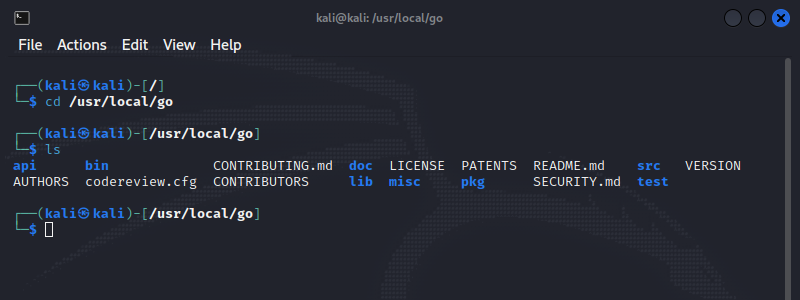
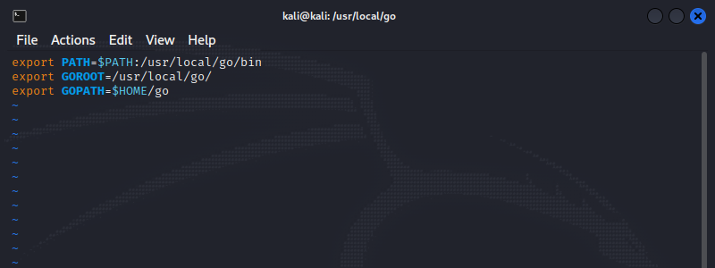

<br />

[Go](https://go.dev/) (also referred to as **Golang**) is a statically typed and compiled programming language. Syntactically similar to C, Go is fast, easy to learn and was developed at Google by Robert Griesemer, Rob Pike, and Ken Thompson.

## Update System
Before proceeding to a new installation of Go, it's a good idea to first check our system is up to date.
```bash
sudo apt update
sudo apt full-upgrade -y
```

## Remove Existing Versions of Go
In addition, we should also check if we already have an earlier version of Go installed, and remove it to prevent any conflicts during installation.
```bash
which go
```

> Using `go version` will also suffice.

<br /><br />

To remove an existing Go package, remove it using:
```bash
rm -rf /path/to/go
```

## Downloading Go
To begin installation, first download the tar.gz package from the official [Golang webpage](https://go.dev/dl/). Be sure to grab the latest stable binary release.

Then, extract the tarball using `tar` to a directory of your choice. In this instance, we'll choose `/usr/local`, using the `-C` flag to point to that directory.
```bash
tar -C /usr/local -xzf go1.18.2.linux-amd64.tar.gz
```

>- `-xzf` refers to a set of separate flags in unison.<br />
>- `-x` = extract, `-z` = gzipped archive, `-f` = get from a file

<br />

Once extraction is complete, we can navigate into that directory and make sure the files have been extracted for some extra safe measure.
```bash
cd /usr/local/go
ls
```



## Set The PATH Variables
The final step is to define the `$PATH` environment variables for Go in your shell's configuration file, so our system knows where to find the executables.

First open the file:
```bash
sudo vim ~/.bash_profile
```

> Note: If you're using zsh as your default shell, you should open `~/.zshrc`.

This will open the file with write access. Simply add these lines, save the file and exit.
```bash
export PATH=$PATH:/usr/local/go/bin
export GOROOT=/usr/local/go
export GOPATH=$HOME/go
```



Lastly, refresh the configuration file:
```bash
source ~/.bash_profile
```

And just like that, you're all set! To confirm Go is working correctly, run `go version`:
```bash
go version
> go version go1.18.2 linux/amd
```

## Further Resources
- [Go Documentation](https://go.dev/doc/)