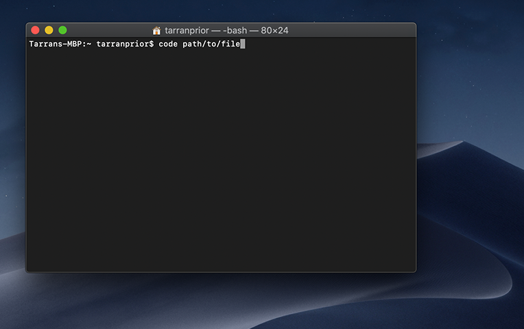

Did you know you're able to launch **VSCode** directly from the command line with a simple `code` command in MacOS?

If not, now you do! And what's more - it's super simple!

 

VSCode comes with a built-in installer which you can access directly from the command palette. Here's how it's done.

## Installation
1. To begin, we first need to install the shell command. Start by launching VSCode and open the command palette using the shortcut `⌘-Shift-P` (`Cmd-Shift-P`).

   > 📍 You can also go to "View" > "Command Palette" in the taskbar and type `>`.
   
    

2. From here, simply type `shell command` and select the option "**Shell Command: Install 'code' command in PATH**" (usually the first option.)

   Then enter your device credentials to confirm the installation.

 

## Usage
Now you've got the `code` command installed in the shell, you can use it just like any other text editor like `vim` or `nano`.

For example, let's say you want to open the file `index.js`. You'll simply enter: `code path/to/index.js`, which will immediately launch VSCode with the selected file.

 

## Conclusion
And that's all folks. You now have direct access to VSCode from the terminal with a simple `code` command.

More useful tricks for MacOS development to come!