I wrote this post back in 2016 *ish* when I was super into **web and digital design**, and decided to throw it back online since it was a pretty *handy-dandy* list to have in the bookmarks, and also nice for preservation purposes.

Then I thought it might be fun to revisit them, and see which sites are still up and running so I can update the list. Turns out, all of them - over five years later!

So, to keep things fresh (*and colourful, har har har*) I've added an additional **twenty** entries which cover the latest colour tools on the interwebs in 2022.

Let's explore some colour!

## 1 - Coolors
[Coolors](https://coolors.co) is a light, responsive and super-fast online tool for generating colour schemes fast. You can [create](https://coolors.co/aaaaaa-bbbbbb-cccccc-dddddd-eeeeee), save, share and [explore](https://coolors.co/palettes/trending) colour palettes in seconds by using Coolors' neat interface.

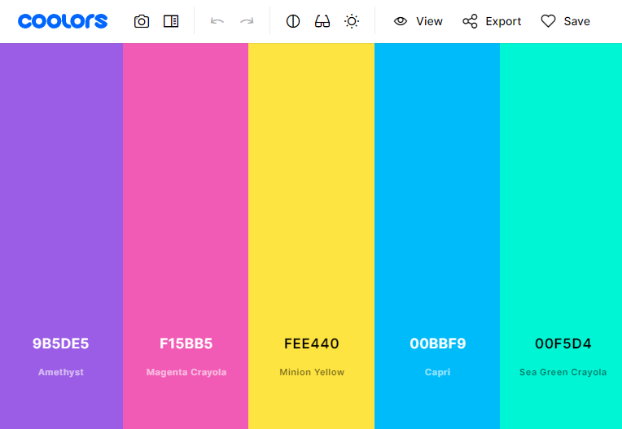

## 2 - Adobe Color
Bragging thousands of colour schemes, [Adobe Color](https://color.adobe.com/explore) (previously Adobe Color CC) is a real gem to designers.

There's a huge catalogue of schemes to choose from, and the site is equipped with a bunch of useful tools including a [colour generation tool](https://color.adobe.com/create/color-wheel), allowing users to create and save schemes based on colour rules.

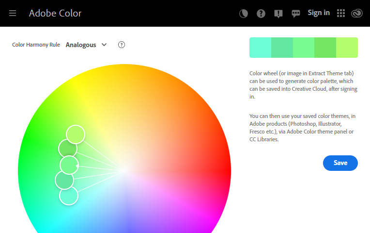

## 3 - Color Hunt
[Color Hunt](https://colorhunt.co/) offers a place to share and discover colour palettes. The collection of colour schemes were all created by Color Hunt's community, and also features an online creation tool as well as a nifty plugin you can add to Chrome.

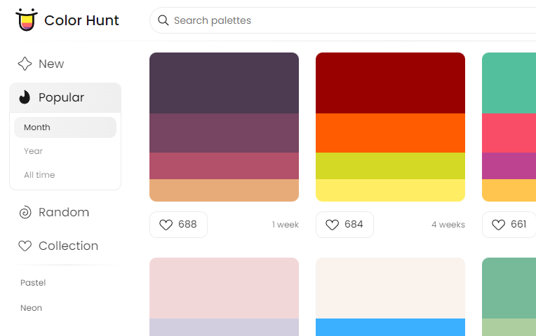

## 4 - Material UI Colors
[Material UI Colors](https://materialui.co/colors/) is an extremely light, simplistic tool with a selective palette of material design colours. Just click a colour and the hex code is instantly copied to your clipboard.

## 5 - Flat UI Colors
Similar to the tool above, [Flat UI Colors](https://flatuicolors.com/) also provides a selective palette of colours. Created by Panda Network, users can change the colour format (Hex, RGB, etc.) and copy colour codes in a click.

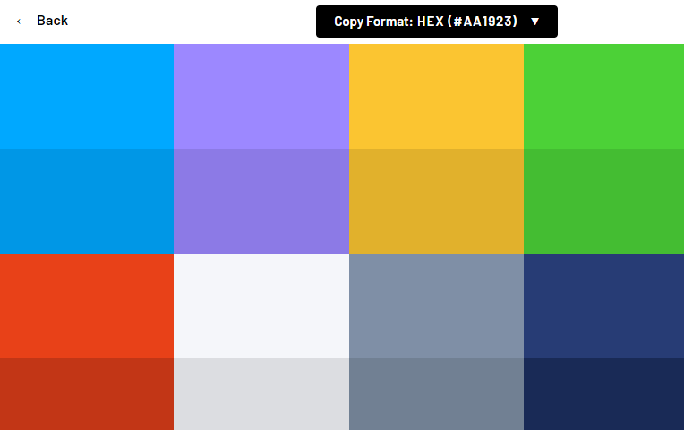

## 6 - 0to255
[0to255](https://0to255.com/) is a colour tool that makes it easy to lighten and darken colours.

## 7 - ColourCode
[ColourCode](https://www.toptal.com/designers/colourcode) is a tool that allows you to combine colours based on cursor movement and position. Move your cursor around the page to explore colours and left click to select a colour.

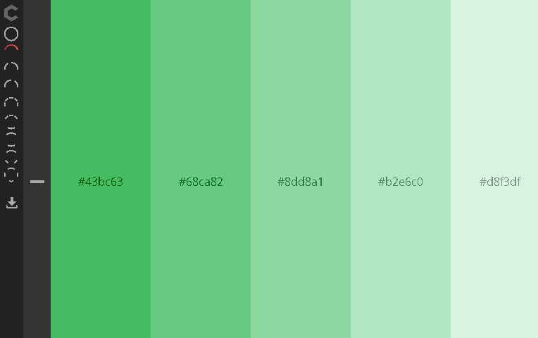

## 8 - Color Koya
Created by web designer Atticus Koya, [Color Koya](https://color.koya.io/) is a simple colour tool with a trendy selection of flat design colours.

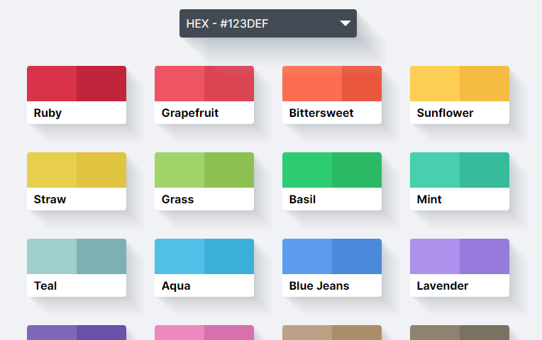

## 9 - Hello Color
An extremely simple [colour contrast creation tool](https://jxnblk.github.io/hello-color/). Generate contrasting colours at the click of a button.

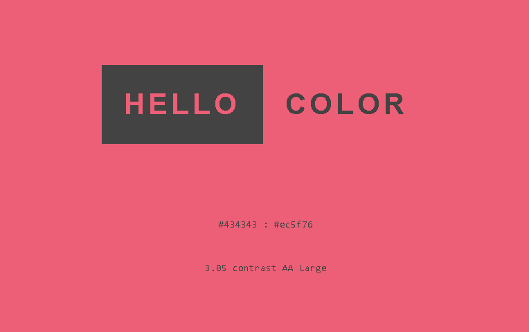

## 10 - Colrd
[Colrd](http://colrd.com/) is a platform for discovering new and innovative colour schemes and palettes. There's a neat selection of features on the site, including a discovery tool, gradients and a patterns category.

## 11 - Material Palette
Another collection of [material design colours](https://www.materialpalette.com/) which generates user interface previews and colour palettes based on user selection.

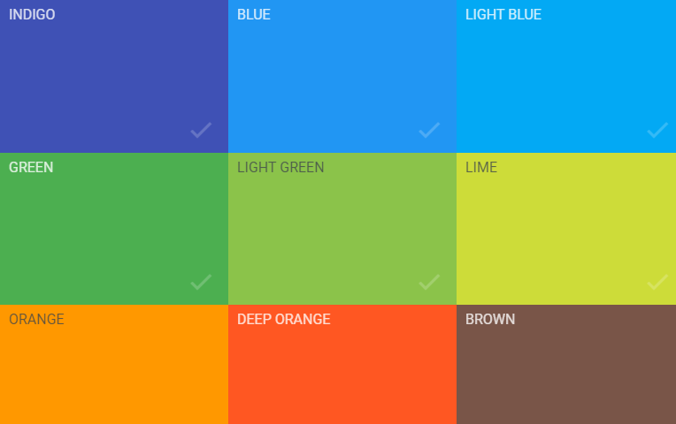

## 12 - Picular
[Picular](https://picular.co/) is a lightweight, ⚡ blazing-fast search engine which provides colours from queries.

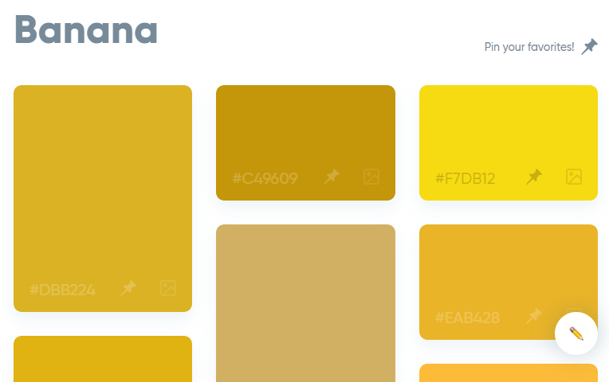

## 13 - Color Palette Generator by Canva
This [tool by Canva](https://www.canva.com/colors/color-palette-generator/) allows users to generate a colour palette based on images and photographs. Simply upload an image and generate a colour scheme in seconds.

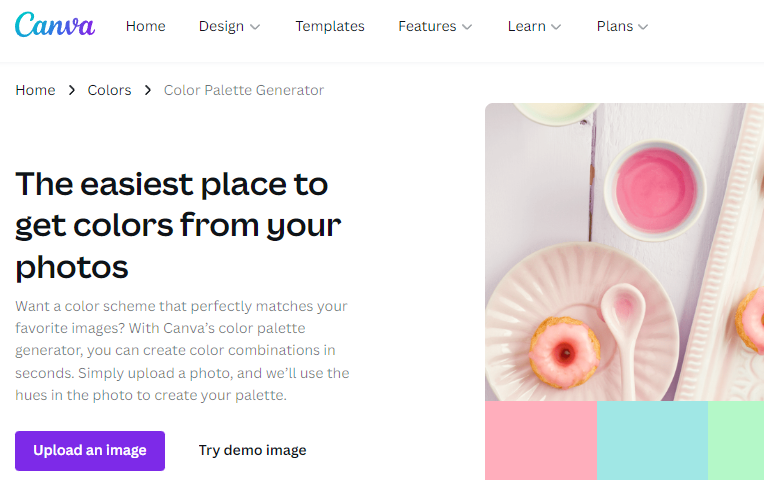

## 14 HueSnap
[HueSnap](https://www.huesnap.com/) provides a platform where you can easily snap colours to a palette, share your creations, explore others, and even sync customised palettes across your devices for easy access.

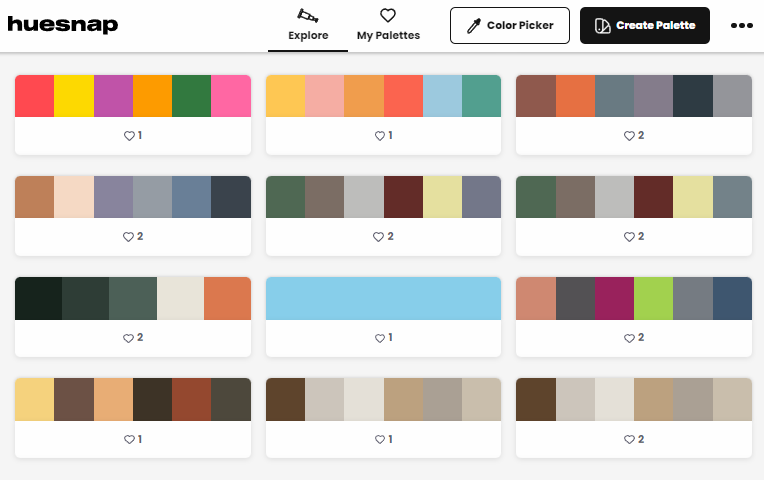

## 15 Colorable
[Colorable](https://colorable.jxnblk.com/) is an open-source tool that allows you to take a set colour palette and get contrast values for every possible combination - useful for finding safe colour combinations with predefined colours and includes pass/fail scores for the WCAG accessibility guidelines.

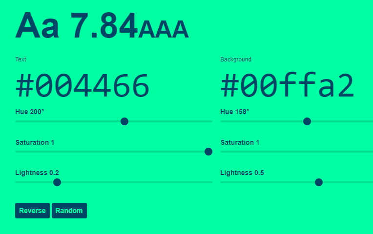

## 16 - ColorLeap
Probably one of the most innovative tools in this list (and a top favourite of mine!) [ColorLeap](https://colorleap.app/home) allows you to "take a leap through time and see the colours of history."

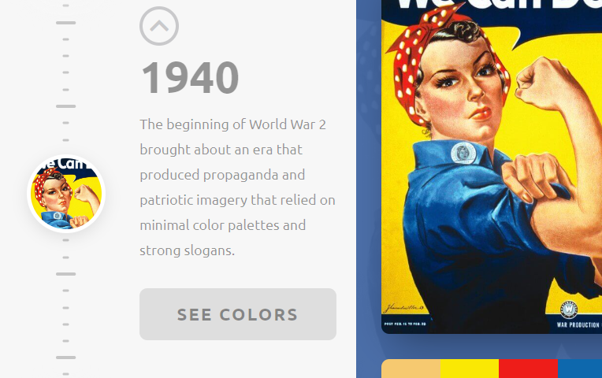

## 17 - Palettte
[Palettte.app](https://palettte.app/) is the definite palette editing and remapping tool.

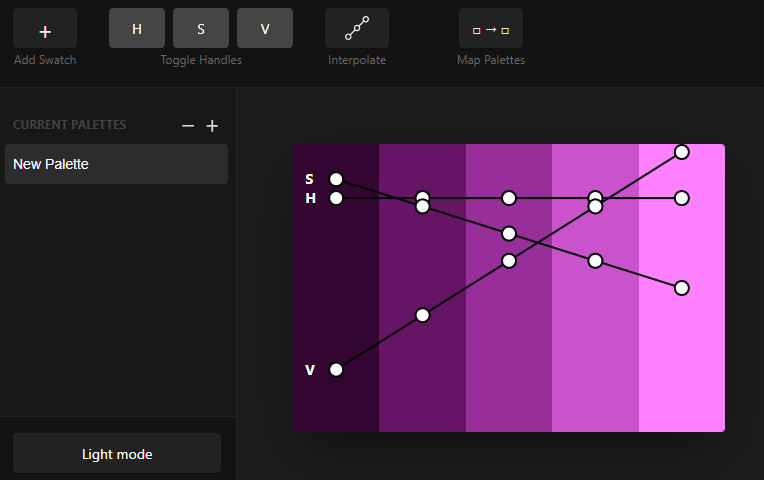

## 18 - Pigment
[Pigment](https://pigment.shapefactory.co/) offers a unique way to explore colour using lighting and pigment.

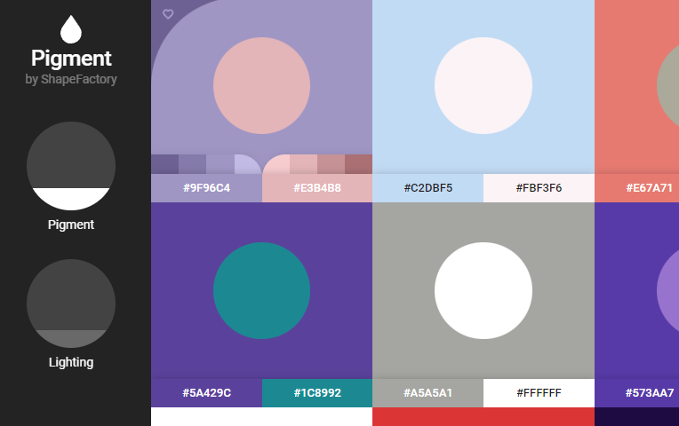

## 19 - Scale
"This is [Scale](https://hihayk.github.io/scale/#4/6/50/80/-51/67/20/14/31E9EB/164/23/84/white) — a generative way to create colour scales."

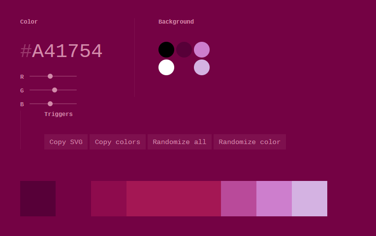

## 20 WebGradients
[WebGradients](https://webgradients.com/) is a free collection of 180 linear gradients that you can use as
content backdrops in any part of your website. Easy copy CSS3 crossbrowser code
and use it in a moment! We've also prepared a .PNG version of each gradient. 
As a bonus, there are packs for Sketch & Photoshop.

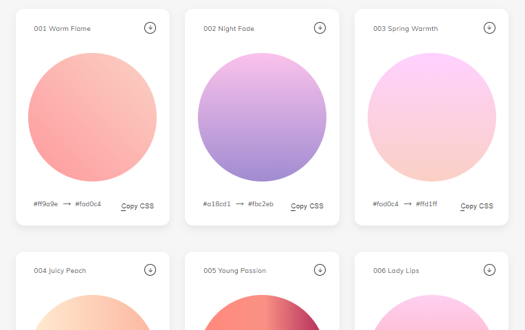

## 21 - Eggradients
Similar to above, [Eggradients](https://www.eggradients.com/) is another free collection of linear gradients - but in the form of eggs! Something I haven't yet seen on this list is innovation to turn colours into [NFTs](https://opensea.io/collection/eggradietns), and that's exactly what Eggradients does.

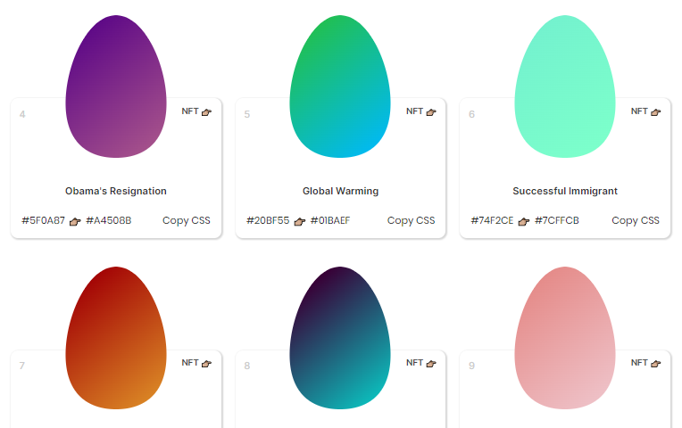

## 22 - Scheme Color
[Scheme Color](https://www.schemecolor.com/) is a collection of thousands of downloadable colour schemes. At the time of writing, there are over 800 pages to explore.

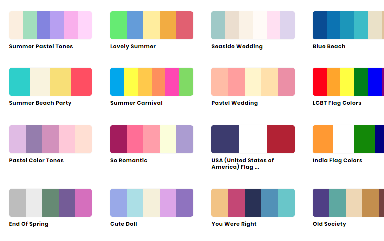

## 23 Colors.lol
[Colors.lol](https://colors.lol/) offers "overly descriptive colour palettes" to give your colours a little more personality.

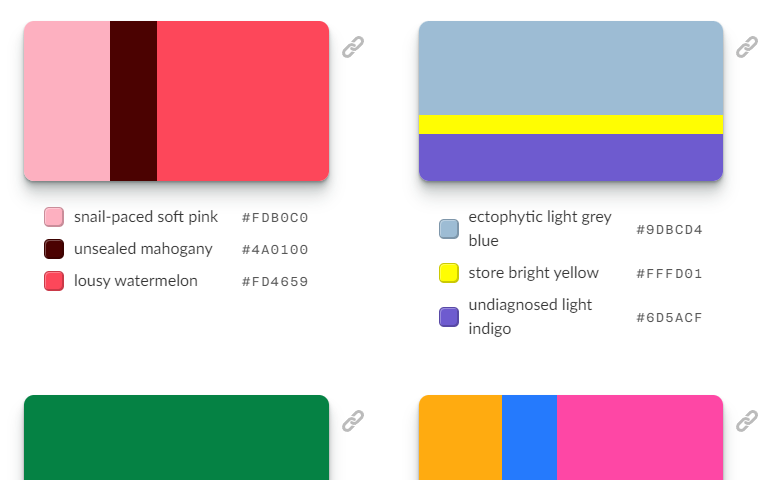

## 24 - GradPad
[GradPad](http://ourownthing.co.uk/gradpad.html) is an intuitive CSS gradient generator with a library of existing schemes to explore.

Psst! Check out the [creator's](http://www.ourownthing.co.uk/) webpage too! They have a portfolio of other innovative tools and applications that may spark your interest.

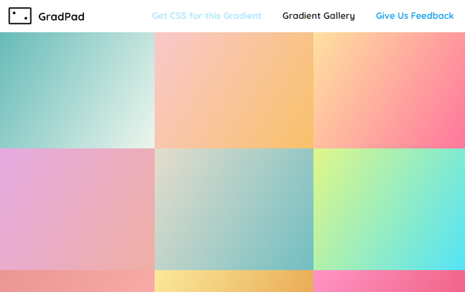

## 25 BrandColors
The biggest collection of official brand colour codes around. [BrandColors](https://brandcolors.net/) allows you to quickly find colour schemes the big brands are using.

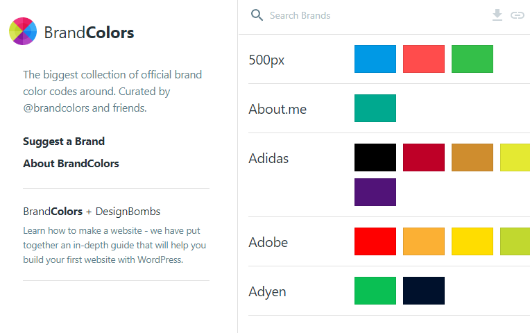

## 26 Art Palette by Google (Google Experiments)
[Art Palette](https://artsexperiments.withgoogle.com/artpalette/colors/893f21-795c33-ba9f72-241c14-492e1a) works as a search engine that finds artworks based on your chosen colour palette. Using this tool, you can explore how the same five colours from Van Gogh's Irises can be related to a 16th century Iranian folio or Monet's water lilies.

Art Palette can help creative experts in art, design and beyond to make informed choices regarding colour palettes, understanding the context and history behind each one.

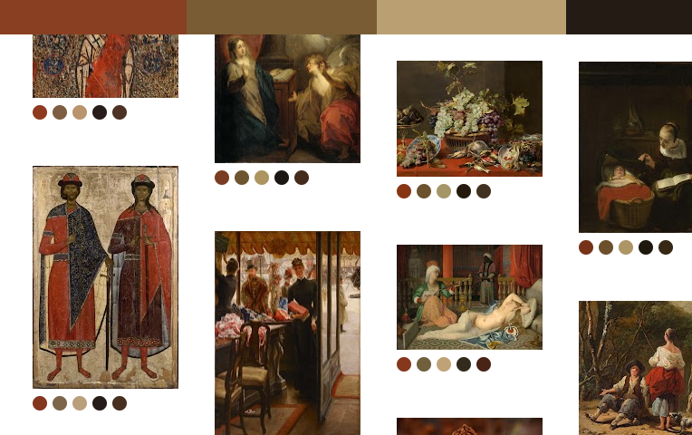

## 27 - EvaDesign
[EvaDesign](https://colors.eva.design/) allows you to generate colour palettes using deep learning.

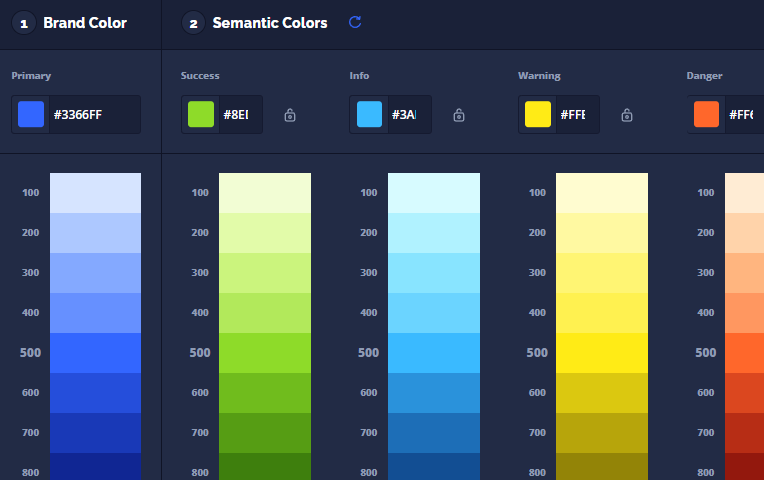

## 28 - Muzli Colors
[Muzli Colors](https://colors.muz.li/) is a tool which allows you to quickly create and edit colour palettes, colour match, and even preview and download customised UI kits per your own colour choices.

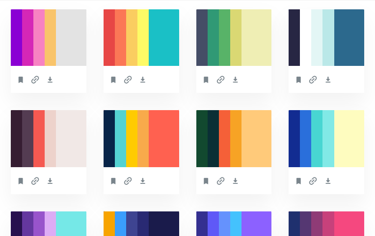

## 29 - Colorinspire
[Colorinspire](https://colorinspire.webflow.io/) is a curation of colour palettes that was born from an Instagram account. You can read the full story on the web page (or click [here](https://medium.com/the-an-blog/color-combination-of-the-week-9012d3a275a7)!)

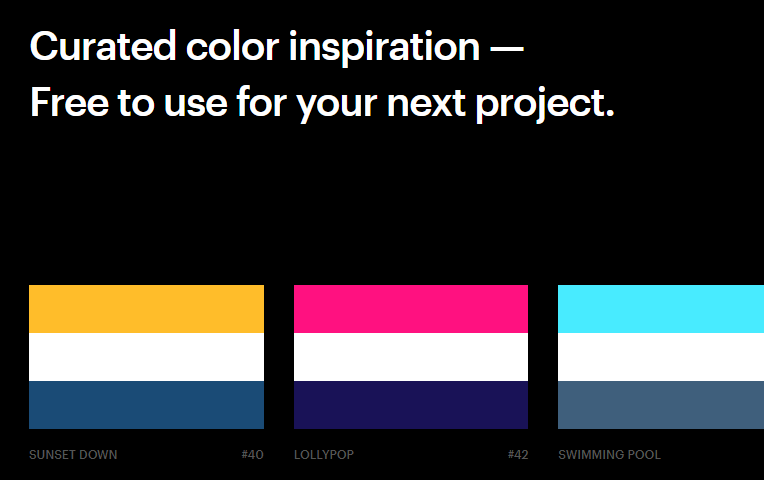

## 30 - ColorSpace
Never waste hours on finding the perfect colour palette again! [ColorSpace](https://mycolor.space/) generates palettes from a single hex code.

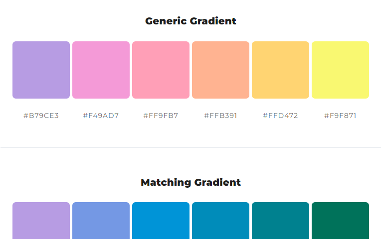

## 31 - Colormind
[Colormind](http://colormind.io/) is a colour scheme generator that uses deep learning. It can learn colour styles from photographs, movies, and popular art. Different datasets are loaded each day, so new inspiration is added each day.

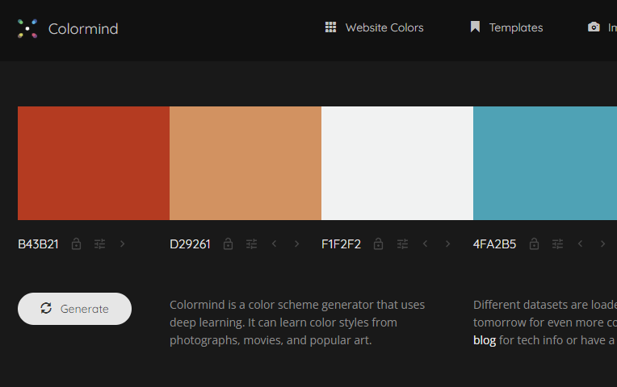
